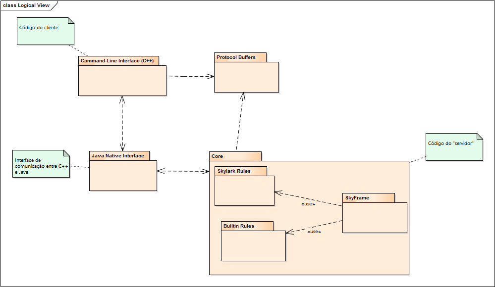
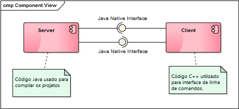
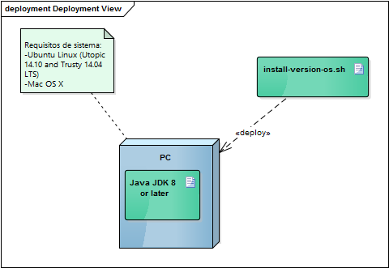

# Relatório 3 - Arquitetura de Software #

**Conteúdos**
- [Arquitetura de Software](#relatório-3---arquitetura-de-software)
	- [Introdução](#introdução)
	- [Logical View](#logical-view)
	- [Implementation View](#implementation-view)
	- [Deployment View](#deployment-view)
	- [Process View](#process-view)
	- [Referências](#referências)
	- [Contribuições](#contribuições)
	- [Autores](#autores)

## Introdução ##

A arquitetura de *software* inclui, em geral, todas as decisões importantes sobre a organização e o sistema de software. Os diagramas apresentam a organização fundamental do sistema, os seus componentes e as relações entre eles. Assim, é possível analisar a evolução e o desenvolvimento do projeto.

No caso concreto do Bazel, depois de uma análise rigorosa ao código disponível e à forma como ele está organizado, chegamos a algumas conclusões. Entre elas, destacam-se a ausência de uma arquitetura rigorosa e definida, a existência de um propósito válido de existência e a aposta num objetivo claro e útil para diversos serviços.

## *Logical View* ##

## *Implementation View* ##

Como dito nos relatórios anteriores, o Bazel é constituído por diversas linguagens de programação. Assim, do lado do cliente, isto é, a interface para o utilizador, é em linha de comandos elaborada em C++. Para comunicar com o servidor (que é a mesma máquina do utilizador) é utilizada uma [Java Native Interface](https://en.wikipedia.org/wiki/Java_Native_Interface) que vai chamar outras aplicações/linguagens (como Java) para compilar o projeto. Resumindo, o Bazel pode ser resumido a duas componentes: o servidor e o cliente. Ambas as componentes comunicam entre si sendo que no cliente é feito o pedido para compilar, esta informação é comunicada (por meio de uma interface) ao servidor que trata deste processo e devolve o resultado (novamente através de uma interface) ao cliente.

## *Deployment View* ##

## *Process View* ##

## Referências ##

* Página oficial: http://bazel.io/
* Estrutura do código: http://bazel.io/contributing.html
* Guia de instalação: http://bazel.io/docs/install.html

## Contribuições ##
* António Ramadas: 
* João Guarda:
* Rui Vilares: 
* Trabalho em grupo: 4 horas.

## Autores ##

Turma 1 - Grupo 4

* [António Manuel Vieira Ramadas](https://github.com/antonio-ramadas)
* [João Diogo Trindade Guarda](https://github.com/Digas29)
* [Rui Miguel Teixeira Vilares](https://github.com/RuiVilares)

[Engenharia de Software (ESOF)](https://sigarra.up.pt/feup/pt/ucurr_geral.ficha_uc_view?pv_ocorrencia_id=368707)

Faculdade de Engenharia da Universidade do Porto

31 de outubro de 2015
