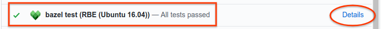

# Configuring Bazel CI to Test Bazel Rules for Remote Execution

*  [Overview](#overview)
*  [Prerequisites](#prerequisites)
*  [Setting up the Bazel CI for testing](#setting-up-the-bazel-ci-for-testing)
*  [Troubleshooting failed builds and tests](#troubleshooting-failed-builds-and-tests)
*  [Using a custom container in the `rbe_ubuntu1604` CI config](#using-a-custom-container-in-the-rbe_ubuntu1604-ci-config)
   *  [Pulling the `rbe-ubuntu16-04` from Container Registry](#pulling-the-rbe-ubuntu16-04-from-container-registry)
   *  [Building the `rbe-ubuntu16-04` container from source](#building-the-rbe-ubuntu16-04-container-from-source)
   *  [Running the custom container](#running-the-custom-container)
   *  [Adding resources to the custom container](#adding-resources-to-the-custom-container)
   *  [Specifying the build platform definition](#specifying-the-build-platform-definition)
   *  [Configuring Buildkite](#configuring-buildkite)

## Overview

This document is for owners and maintainers of Bazel rule repositories. It
describes how to configure the Bazel Continuous Integration (CI) system for your
repository to test your rules for compatibility against a remote execution
scenario. The instructions in this document apply to projects stored in GitHub
repositories.

## Prerequisites

Before completing the steps in this document, ensure the following:

*   Your GitHub repository is part of the
    [Bazel GitHub organization](https://github.com/bazelbuild).
*   You have configured Buildkite for your repository as described in
    [Bazel Continuous Integration](https://github.com/bazelbuild/continuous-integration/tree/master/buildkite).

## Setting up the Bazel CI for testing

1.  In your `.bazelci/presubmit.yml` file, do the following:

    a.  Add a config named `rbe_ubuntu1604`.

    b.  In the `rbe_ubuntu1604` config, add the build and test targets you want to test against remote execution.

2.  Add the[`bazel-toolchains`](https://github.com/bazelbuild/bazel-toolchains)
    GitHub repository to your `WORKSPACE` file, pinned to the
    [latest release](https://releases.bazel.build/bazel-toolchains.html).

3.  Send a pull request with your changes to the `presubmit.yml` file. (See
    [example pull request](https://github.com/bazelbuild/rules_rust/commit/db141526d89d00748404856524cedd7db8939c35).)

4.  To view build results, click **Details** for the RBE (Ubuntu
    16.04) pull request check in GItHub, as shown in the figure below. This link
    becomes available after the pull request has been merged and the CI tests
    have run. (See
    [example results](https://source.cloud.google.com/results/invocations/375e325c-0a05-47af-87bd-fed1363e0333).)

    

5.  (Optional) Set the **bazel test (RBE (Ubuntu 16.04))** check as a test
    required to pass before merging in your branch protection rule. The setting
    is located in GitHub in **Settings > Branches > Branch protection rules**,
    as shown in the following figure.

    

## Troubleshooting failed builds and tests

If your build or tests fail, it's likely due to the following:

*   **Required build or test tools are not installed in the default container.**
    Builds using the `rbe_ubuntu1604` config run by default inside an
    [`rbe-ubuntu16-04`](https://pantheon.corp.google.com/marketplace/details/google/rbe-ubuntu16-04)
    container, which includes tools common to many Bazel builds. However, if
    your rules require tools not present in the default container, you must
    create a custom container based on the
    [`rbe-ubuntu16-04`](https://pantheon.corp.google.com/marketplace/details/google/rbe-ubuntu16-04)
    container and include those tools as described later in this document.

*   **Build or test targets are using rules that are incompatible with remote
    execution.** See
    [Adapting Bazel Rules for Remote Execution](https://docs.bazel.build/versions/master/remote-execution-rules.html)
    for details about compatibility with remote execution.

## Using a custom container in the `rbe_ubuntu1604` CI config

The `rbe-ubuntu16-04` container is publicly available at the following URL:

```
http://gcr.io/cloud-marketplace/google/rbe-ubuntu16-04
```

You can pull it directly from Container Registry or build it from source. The
next sections describe both options.

Before you begin, make sure you have installed `gcloud`, `docker`, and `git`.
If you are building the container from source, you must also install the latest
version of Bazel.

### Pulling the `rbe-ubuntu16-04` from Container Registry

To pull the <span style="color:#212121;">Pull the `rbe-ubuntu16-04` container
  from Container Registry, run the following command:</span>

```
gcloud docker -- pull gcr.io/cloud-marketplace/google/rbe-ubuntu16-04@sha256:<sha256-checksum>
```

Replace `<sha256-checksum>` with the SHA256 checksum value for
[the latest container](https://pantheon.corp.google.com/gcr/images/cloud-marketplace/GLOBAL/google/rbe-ubuntu16-04).

### Building the `rbe-ubuntu16-04` container from source

To build the `rbe-ubuntu16-04` container from source, do the following:

1.  Clone the `bazel-toolchains` repository:

    ```
    git clone https://github.com/bazelbuild/bazel-toolchains
    ```

2.  Set up toolchain container targets and build the container as explained in
    [Toolchain Containers](https://github.com/bazelbuild/bazel-toolchains/tree/master/container).

3.  Pull the freshly built container:

    ```
    gcloud docker -- pull gcr.io/<project-id>/<custom-container-name>@sha256:<sha256-checksum>
    ```

### Running the custom container

To run the custom container, do one of the following:

*   If you pulled the container from Container Registry, run the following
    command:

    ```
    docker run -it gcr.io/cloud-marketplace/google/rbe-ubuntu16-04@sha256:<sha256-checksum> /bin/bash
    ```

    Replace `sha256-checksum` with the SHA256 checksum value for the
    [latest container](https://pantheon.corp.google.com/gcr/images/cloud-marketplace/GLOBAL/google/rbe-ubuntu16-04).

*   If you built the container from source, run the following command:

    ```
    docker run -it gcr.io/<project-id>/<custom-container-name>@sha256:<sha256sum> /bin/bash
    ```

### Adding resources to the custom container

Use a [`Dockerfile`](https://docs.docker.com/engine/reference/builder/) or
[`rules_docker`](https://github.com/bazelbuild/rules_docker) to add resources or
alternate versions of the original resources to the `rbe-ubuntu16-04` container.
If you are new to Docker, read the following:

*   [Docker for beginners](https://github.com/docker/labs/tree/master/beginner)
*   [Docker Samples](https://docs.docker.com/samples/)

For example, the following `Dockerfile` snippet installs `<my_tool_package>`:

```
FROM gcr.io/cloud-marketplace/google/rbe-ubuntu16-04@sha256:<sha256-checksum>
RUN apt-get update && yes | apt-get install -y <my_tool_package>
```

### Pushing the custom container to Container Registry

Once you have customized the container, build the container image and push it to
Container Registry as follows:

1. Build the container image:

    ```
    docker build -t <custom-container-name> .docker tag <custom-container-name> gcr.io/<project-id>/<custom-container-name>
    ```

2.  Push the container image to Container Registry:

    ```
    gcloud docker -- push gcr.io/<project-id>/<custom-container-name>
    ```

3.  Navigate to the following URL to verify the container has been pushed:

    ```
    https://console.cloud.google.com/gcr/images/<project-id>/GLOBAL/<custom-container-name>
    ````

4.  Take note of the SHA256 checksum of your custom container. You will need to
    provide it in your build platform definition later in this document.

5.  Configure the container for public access as described in  publicly
    accessible as explained in
    [Serving images publicly](https://cloud.google.com/container-registry/docs/access-control#serving_images_publicly).

    For more information, see
    [Pushing and Pulling Images](https://cloud.google.com/container-registry/docs/pushing-and-pulling).


### Specifying the build platform definition

You must include a
[Bazel platform](https://docs.bazel.build/versions/master/platforms.html)
configuration in your custom toolchain configuration, which allows Bazel to
select a toolchain appropriate to the desired hardware/software platform. See
this [example platform configuration](https://github.com/tensorflow/tensorflow/blob/master/third_party/toolchains/BUILD)
for the TensorFlow `ubuntu16-04` container.

Create a similar configuration (that is, using the same constraints) but replace
the value of the `container-image` property with the name of your custom
container, as well as your GCR project ID and container image checksum. For
example:

```
docker://gcr.io/<project-id>/<custom-container-name> @sha256:<sha256sum>
```

Once you have created a `BUILD` file with the platform rule, place it within
your project tree. For example, `/platforms/BUILD`.

### Configuring Buildkite

Add the appropriate `build_flag` and `test_flag` entries to the
`.bazelci/presubmit.yml` file in your `rbe_ubuntu1604 `config to switch your
builds to using your custom container.
See [example](https://github.com/bazelbuild/rules_docker/pull/484).

**Note:** The example linked above uses a platform definition from the
`@bazel_toolchains` repo. If your platform rule is in `/platforms/BUILD`, the
entries would look as follows:

```
"--extra_execution_platforms=//platforms:<your_platform_target>"
"--host_platform=//platforms:<your_platform_target>"
"--platforms=//platforms:<your_platform_target>"
```
