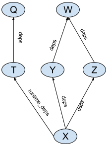

# Aspects

**Status: Experimental**. We may make breaking changes to the API, but we will
  help you update your code.

Aspects allow augmenting build dependency graphs with additional information
and actions. Some typical scenarios when aspects can be useful:

*   IDEs that integrate Bazel can use aspects to collect information about the
    project
*   Code generation tools can leverage aspects to execute on their inputs in
    "target-agnostic" manner. As an example, BUILD files can specify a hierarchy
    of [protobuf](https://developers.google.com/protocol-buffers/) library
    definitions, and language-specific rules can use aspects to attach
    actions generating protobuf support code for a particular language

## Aspect basics

Bazel BUILD files provide a description of a project’s source code: what source
files are part of the project, what artifacts (_targets_) should be built from
those files, what the dependencies between those files are, etc. Bazel uses
this information to perform a build, that is, it figures out the set of actions
needed to produce the artifacts (such as running compiler or linker) and
executes those actions. Bazel accomplishes this by constructing a _dependency
graph_ between targets and visiting this graph to collect those actions.

Consider the following BUILD file:

```python
java_library(name = 'W', ...)
java_library(name = 'Y', deps = [':W'], ...)
java_library(name = 'Z', deps = [':W'], ...)
java_library(name = 'Q', ...)
java_library(name = 'T', deps = [':Q'], ...)
java_library(name = 'X', deps = [':Y',':Z'], runtime_deps = [':T'], ...)
```

This BUILD file defines a dependency graph shown in Fig 1.



Bazel analyzes this dependency graph by calling implementations of
[rules](rules.md) (in this case "java_library" starting from leaves of
the dependency graph). These implementations generate actions that build
artifacts (such as Jar files), and provide information (such as locations
and names of those artifacts) to their dependencies in providers that
they return. Their dependencies can access those providers through the
[Target object](lib/Target.html). In other words, every target
defined in the BUILD file generates a node in the dependency graph, and
the appropriate rule implementation function is called for every node.

Aspects are similar to rules in that they have an implementation function that
generates actions and returns providers. However, their power comes from
the way the dependency graph is built for them. An aspect has an implementation
and a list of all attributes it propagates along. Consider an aspect A that
propagates along attributes named "deps". This aspect can be applied to
a target X, yielding an aspect application node A(X). During its application,
aspect A is applied recursively to all targets that X refers to in its "deps"
attribute (all attributes in A's propagation list). Thus a single act of
applying aspect A to a target X yields a "shadow graph" of the original
dependency graph of targets (see Fig.2).


The only edges that are shadowed are the edges along the attributes in
the propagation set, thus the `runtime_deps` edge is not shadowed in this
example. An aspect implementation function is then invoked on all nodes in
the shadow graph similar to how rule implementations are invoked on the nodes
of the original graph.

## Defining aspects

Aspect definitions are similar to rule definitions, and defined using
the [`aspect`](lib/globals.html#aspect) function. Let's take a look at
the example:

```python
metal_proto_aspect = aspect(implementation = _metal_proto_aspect_impl,
    attr_aspects = ["deps"],
    attrs = {
      "_protoc" : attr.label(
          default=Label("//tools:metal_protoc"),
          executable = True
      )
    }
)
```

Just like a rule, an aspect has an implementation function. ``attr_aspects``
specify the aspect's propagation set: a list of attributes of rules along which
the aspect propagates.

``attrs`` defines a set of attributes for aspects. Aspects are allowed
to have private attributes of types ``label`` or ``label_list``. Private label
attributes can be used to specify dependencies on tools or libraries that are
needed for actions generated by aspects. Aspects may also have normal attributes
of type ``string``, called parameters, so long as ``values`` is specified. Any
string attributes must match string attributes on the Skylark rule requesting
the aspect, and they inherit their value from the rule. Aspects with parameters
cannot be requested on the bazel command-line.

### Implementation functions

Aspect implementation functions are similiar to the rule implementation
functions. They return [providers](rules.md#providers), can generate
[actions](rules.md#actions) and take two arguments:

*    `target`: the [target](lib/Target.html) the aspect is being applied to.
*    `ctx`: [`ctx`](lib/ctx.html) object that can be used to access attributes and
     generate outputs and actions.

Example:

```python
MetalProtoInfo = provider()
def _metal_proto_aspect_impl(target, ctx):
    # For every `src` in proto_library, generate an output file
    proto_sources = [f for src in ctx.rule.attr.srcs
                       for f in src.files]
    outputs = [ctx.actions.declare_file(f.short_path + ".metal")
               for f in proto_sources]
    ctx.actions.run(
        executable = ctx.executable._protoc,
        argument = ...
        inputs = proto_sources
        outputs = outputs)
    transitive_outputs = depset(outputs)
    for dep in ctx.rule.attr.deps:
        transitive_outputs = transitive_outputs | dep.metal_proto.transitive_outputs
    return [MetalProtoInfo(direct_outputs = outputs,
                           transitive_outputs = transitive_outputs)]
```

The implementation function can access the attributes of the target rule via
[`ctx.rule.attr`](lib/ctx.html#rule). It can examine providers that are
provided  by the target to which it is applied (via the `target` argument).

Just like a rule implementation function, an aspect implementation function
returns a struct of providers that are accessible to its dependencies.

*   The set of providers for an aspect application A(X) is the union of providers
    that come from the implementation of a rule for target X and from
    the implementation of aspect A. It is an error if a target and an aspect that
    is applied to it each provide a provider with the same name.
*   For the aspect implementation, the values of attributes along which
    the aspect is propagated (from the `attr_aspect` list) are replaced with
    the results of an application of the aspect to them. For example, if target
    X has Y and Z in its deps, `ctx.rule.attr.deps` for A(X) will be [A(Y), A(Z)].
    In the `_metal_proto_aspect_impl` function above, ctx.rule.attr.deps will be
    Target objects that are the results of applying the aspect to the 'deps'
    of the original target to which the aspect has been applied.
    That allows the aspect to examine `metal_proto` provider on them.


## Applying aspects

Aspect propagation can be initiated either from a rule or from the command line.

### Applying aspects to rule attributes

Rules can specify that they want to apply aspects to their dependencies.
The aspects to be applied to a particular attribute can be specified
using the `aspects` parameter to `attr.label` or `attr.label_list` function:

```python
metal_proto_library = rule(implementation = _impl,
   attrs = {
     'proto_deps' : attr.label_list(aspects = [metal_proto_aspect]),
   },
)
```

If a rule specifies an aspect on its attributes, the values of that attribute
will be replaced by the result of aspect application to them (similar to
what happens during aspect propagation). Thus implementation of
`metal_proto_library` will have access to `metal_proto` providers
on the target objects representing its `proto_deps` attribute values.

### Applying aspects from command line.

Aspects can also be applied on the command line, using the `--aspects` flag:


```
bazel build //java/com/company/example:main \
      --aspects path/to/extension.bzl%metal_proto_aspect
```

`--aspects` flag takes one argument, which is a specification of the aspect in
the format `<extension file path>%<aspect top-level name>`.


