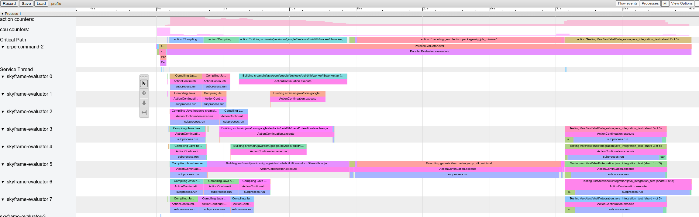

# Optimizing Performance


When writing rules, the most common performance pitfall is to traverse or copy
data that is accumulated from dependencies. When aggregated over the whole
build, these operations can easily take O(N^2) time or space. To avoid this, it
is crucial to understand how to use depsets effectively.

This can be hard to get right, so Bazel also provides a memory profiler that
assists you in finding spots where you might have made a mistake. Be warned:
The cost of writing an inefficient rule may not be evident until it is in
widespread use.


## Use depsets

Whenever you are rolling up information from rule dependencies you should use
[depsets](lib/depset.html). Only use plain lists or dicts to publish information
local to the current rule.

A depset represents information as a nested graph which enables sharing.

Consider the following graph:

```
C -> B -> A
D ---^
```

Each node publishes a single string. With depsets the data looks like this:

```
a = depset(direct=['a'])
b = depset(direct=['b'], transitive=[a])
c = depset(direct=['c'], transitive=[b])
d = depset(direct=['d'], transitive=[b])
```

Note that each item is only mentioned once. With lists you would get this:

```
a = ['a']
b = ['b', 'a']
c = ['c', 'b', 'a']
d = ['d', 'b', 'a']
```

Note that in this case `'a'` is mentioned four times! With larger graphs this
problem will only get worse.

Here is an example of a rule implementation that uses depsets correctly to
publish transitive information. Note that it is OK to publish rule-local
information using lists if you want since this is not O(N^2).

```
MyProvider = provider()

def _impl(ctx):
  my_things = ctx.attr.things
  all_things = depset(
      direct=my_things,
      transitive=[dep[MyProvider].all_things for dep in ctx.attr.deps]
  )
  ...
  return [MyProvider(
    my_things=my_things,  # OK, a flat list of rule-local things only
    all_things=all_things,  # OK, a depset containing dependencies
  )]
```

See the [depset overview](depsets.md) page for more information.

### Avoid calling `depset.to_list()`

You can coerce a depset to a flat list using
[`to_list()`](lib/depset.html#to_list), but doing so usually results in O(N^2)
cost. If at all possible, avoid any flattening of depsets except for debugging
purposes.

A common misconception is that you can freely flatten depsets if you only do it
at top-level targets, such as an `<xx>_binary` rule, since then the cost is not
accumulated over each level of the build graph. But this is *still* O(N^2) when
you build a set of targets with overlapping dependencies. This happens when
building your tests `//foo/tests/...`, or when importing an IDE project.

### Reduce the number of calls to `depset`

Calling `depset` inside a loop is often a mistake. It can lead to depsets with
very deep nesting, which perform poorly. For example:

```python
x = depset()
for i in inputs:
    # Do not do that.
    x = depset(transitive = [x, i.deps])
```

This code can be replaced easily. First, collect the transitive depsets and
merge them all at once:

```python
transitive = []

for i in inputs:
    transitive.append(i.deps)

x = depset(transitive = transitive])
```

This can sometimes be reduced using a list comprehension:

```python
x = depset(transitive = [i.deps for i in inputs])
```

## Use `ctx.actions.args()` for command lines

When building command lines you should use [ctx.actions.args()](lib/Args.html).
This defers expansion of any depsets to the execution phase.

Apart from being strictly faster, this will reduce the memory consumption of
your rules -- sometimes by 90% or more.

Here are some tricks:

* Pass depsets and lists directly as arguments, instead of flattening them
yourself. They will get expanded by `ctx.actions.args()` for you.
If you need any transformations on the depset contents, look at
[ctx.actions.args#add](lib/Args.html#add) to see if anything fits the bill.

* Are you passing `File#path` as arguments? No need. Any
[File](lib/File.html) is automatically turned into its
[path](lib/File.html#path), deferred to expansion time.

* Avoid constructing strings by concatenating them together.
The best string argument is a constant as its memory will be shared between
all instances of your rule.

* If the args are too long for the command line an `ctx.actions.args()` object
can be conditionally or unconditionally written to a param file using
[`ctx.actions.args#use_param_file`](lib/Args.html#use_param_file). This is
done behind the scenes when the action is executed. If you need to explicitly
control the params file you can write it manually using
[`ctx.actions.write`](lib/actions.html#write).

Example:

```
def _impl(ctx):
  ...
  args = ctx.actions.args()
  file = ctx.declare_file(...)
  files = depset(...)

  # Bad, constructs a full string "--foo=<file path>" for each rule instance
  args.add("--foo=" + file.path)

  # Good, shares "--foo" among all rule instances, and defers file.path to later
  # It will however pass ["--foo", <file path>] to the action command line,
  # instead of ["--foo=<file_path>"]
  args.add("--foo", file)

  # Use format if you prefer ["--foo=<file path>"] to ["--foo", <file path>]
  args.add(format="--foo=%s", value=file)

  # Bad, makes a giant string of a whole depset
  args.add(" ".join(["-I%s" % file.short_path for file in files])

  # Good, only stores a reference to the depset
  args.add_all(files, format_each="-I%s", map_each=_to_short_path)

# Function passed to map_each above
def _to_short_path(f):
  return f.short_path
```

## Transitive action inputs should be depsets

When building an action using [ctx.actions.run](lib/actions.html?#run), do not
forget that the `inputs` field accepts a depset. Use this whenever inputs are
collected from dependencies transitively.

```
inputs = depset(...)
ctx.actions.run(
  inputs = inputs,  # Do *not* turn inputs into a list
  ...
)
```

## Hanging

If Bazel appears to be hung, you can hit <kbd>Ctrl-&#92;</kbd> or send
Bazel a `SIGQUIT` signal (`kill -3 $(bazel info server_pid)`) to get a thread
dump in the file `$(bazel info output_base)/server/jvm.out`.

Since you may not be able to run `bazel info` if bazel is hung, the
`output_base` directory is usually the parent of the `bazel-<workspace>`
symlink in your workspace directory.

## Performance profiling

Bazel writes a JSON profile to `command.profile.gz` in the output base by
default. You can configure the location with the
[`--profile`](user-manual.html#flag--profile) flag, for example
`--profile=/tmp/profile.gz`. Location ending with `.gz` are compressed with
GZIP.

To see the results, open `chrome://tracing` in a Chrome browser tab, click
"Load" and pick the (potentially compressed) profile file. For more detailed
results, click the boxes in the lower left corner.

You can use these keyboard controls to navigate:

*   Press `1` for "select" mode. In this mode, you can select
    particular boxes to inspect the event details (see lower left corner).
    Select multiple events to get a summary and aggregated statistics.
*   Press `2` for "pan" mode. Then drag the mouse to move the view. You
    can also use `a`/`d` to move left/right.
*   Press `3` for "zoom" mode. Then drag the mouse to zoom. You can
    also use `w`/`s` to zoom in/out.
*   Press `4` for "timing" mode where you can measure the distance
    between two events.
*   Press `?` to learn about all controls.

### Profile information

Example profile:


There are some special rows:

*   `action counters`: Displays how many concurrent actions are in flight. Click
    on it to see the actual value. Should go up to the value of `--jobs` in
    clean builds.
*   `cpu counters`: For each second of the build, displays the amount of CPU
    that is used by Bazel (a value of 1 equals one core being 100% busy).
*   `Critical Path`: Displays one block for each action on the critical path.
*   `grpc-command-1`: Bazel's main thread. Useful to get a high-level picture of
    what Bazel is doing, for example "Launch Bazel", "evaluateTargetPatterns",
    and "runAnalysisPhase".
*   `Service Thread`: Displays minor and major Garbage Collection (GC) pauses.

Other rows represent Bazel threads and show all events on that thread.

### Common performance issues

When analyzing performance profiles, look for:

*   Slower than expected analysis phase (`runAnalysisPhase`), especially on
    incremental builds. This can be a sign of a poor rule implementation, for
    example one that flattens depsets. Package loading can be slow by an
    excessive amount of targets, complex macros or recursive globs.
*   Individual slow actions, especially those on the critical path. It might be
    possible to split large actions into multiple smaller actions or reduce the
    set of (transitive) dependencies to speed them up. Also check for an unusual
    high non-`PROCESS_TIME` (e.g. `REMOTE_SETUP` or `FETCH`).
*   Bottlenecks, that is a small number of threads is busy while all others are
    idling / waiting for the result (see around 15s-30s in above screenshot).
    Optimizing this will most likely require touching the rule implementations
    or Bazel itself to introduce more parallelism. This can also happen when
    there is an unusual amount of GC.

### Profile file format

The top-level object contains metadata (`otherData`) and the actual tracing data
(`traceEvents`). The metadata contains extra info, for example the invocation ID
and date of the Bazel invocation.

Example:

```json
{
  "otherData": {
    "build_id": "101bff9a-7243-4c1a-8503-9dc6ae4c3b05",
    "date": "Tue Jun 16 08:30:21 CEST 2020",
    "output_base": "/usr/local/google/_bazel_johndoe/573d4be77eaa72b91a3dfaa497bf8cd0"
  },
  "traceEvents": [
    {"name":"thread_name","ph":"M","pid":1,"tid":0,"args":{"name":"Critical Path"}},
    {"cat":"build phase marker","name":"Launch Bazel","ph":"X","ts":-1824000,"dur":1824000,"pid":1,"tid":60},
    ...
    {"cat":"general information","name":"NoSpawnCacheModule.beforeCommand","ph":"X","ts":116461,"dur":419,"pid":1,"tid":60},
    ...
    {"cat":"package creation","name":"src","ph":"X","ts":279844,"dur":15479,"pid":1,"tid":838},
    ...
    {"name":"thread_name","ph":"M","pid":1,"tid":11,"args":{"name":"Service Thread"}},
    {"cat":"gc notification","name":"minor GC","ph":"X","ts":334626,"dur":13000,"pid":1,"tid":11},

    ...
    {"cat":"action processing","name":"Compiling third_party/grpc/src/core/lib/transport/status_conversion.cc","ph":"X","ts":12630845,"dur":136644,"pid":1,"tid":1546}
 ]
}
```

Timestamps (`ts`) and durations (`dur`) in the trace events are given in
microseconds. The category (`cat`) is one of enum values of `ProfilerTask`.
Note that some events are merged together if they are very short and close to
each other; pass `--noslim_json_profile` if you would like to
prevent event merging.

See also the
[Chrome Trace Event Format Specification](https://docs.google.com/document/d/1CvAClvFfyA5R-PhYUmn5OOQtYMH4h6I0nSsKchNAySU/preview).

### analyze-profile

This profiling method consists of two steps, first you have to execute your
build/test with the `--profile` flag, for example

```
$ bazel build --profile=/tmp/prof //path/to:target
```

The file generated (in this case `/tmp/prof`) is a binary file, which can be
postprocessed and analyzed by the `analyze-profile` command:

```
$ bazel analyze-profile /tmp/prof
```

By default, it prints summary analysis information for the specified profile
datafile. This includes cumulative statistics for different task types for each
build phase and an analysis of the critical path.

The first section of the default output is an overview of the time spent
on the different build phases:

```
INFO: Profile created on Tue Jun 16 08:59:40 CEST 2020, build ID: 0589419c-738b-4676-a374-18f7bbc7ac23, output base: /home/johndoe/.cache/bazel/_bazel_johndoe/d8eb7a85967b22409442664d380222c0

=== PHASE SUMMARY INFORMATION ===

Total launch phase time         1.070 s   12.95%
Total init phase time           0.299 s    3.62%
Total loading phase time        0.878 s   10.64%
Total analysis phase time       1.319 s   15.98%
Total preparation phase time    0.047 s    0.57%
Total execution phase time      4.629 s   56.05%
Total finish phase time         0.014 s    0.18%
------------------------------------------------
Total run time                  8.260 s  100.00%

Critical path (4.245 s):
       Time Percentage   Description
    8.85 ms    0.21%   _Ccompiler_Udeps for @local_config_cc// compiler_deps
    3.839 s   90.44%   action 'Compiling external/com_google_protobuf/src/google/protobuf/compiler/php/php_generator.cc [for host]'
     270 ms    6.36%   action 'Linking external/com_google_protobuf/protoc [for host]'
    0.25 ms    0.01%   runfiles for @com_google_protobuf// protoc
     126 ms    2.97%   action 'ProtoCompile external/com_google_protobuf/python/google/protobuf/compiler/plugin_pb2.py'
    0.96 ms    0.02%   runfiles for //tools/aquery_differ aquery_differ
```

## Memory profiling

Bazel comes with a built-in memory profiler that can help you check your rule's
memory use. If there is a problem you can dump the heap to find the
exact line of code that is causing the problem.

### Enabling memory tracking

You must pass these two startup flags to *every* Bazel invocation:

  ```
  STARTUP_FLAGS=\
  --host_jvm_args=-javaagent:$(BAZEL)/third_party/allocation_instrumenter/java-allocation-instrumenter-3.0.1.jar \
  --host_jvm_args=-DRULE_MEMORY_TRACKER=1
  ```
  **NOTE**: The bazel repository comes with an allocation instrumenter.
  Make sure to adjust '$(BAZEL)' for your repository location.

These start the server in memory tracking mode. If you forget these for even
one Bazel invocation the server will restart and you will have to start over.

### Using the Memory Tracker

Let's have a look at the target `foo` and see what it's up to. We add
`--nobuild` since it doesn't matter to memory consumption if we actually build
or not, we just have to run the analysis phase.

```
$ bazel $(STARTUP_FLAGS) build --nobuild //foo:foo
```

Let's see how much memory the whole Bazel instance consumes:

```
$ bazel $(STARTUP_FLAGS) info used-heap-size-after-gc
> 2594MB
```

Let's break it down by rule class by using `bazel dump --rules`:

```
$ bazel $(STARTUP_FLAGS) dump --rules
>

RULE                                 COUNT     ACTIONS          BYTES         EACH
genrule                             33,762      33,801    291,538,824        8,635
config_setting                      25,374           0     24,897,336          981
filegroup                           25,369      25,369     97,496,272        3,843
cc_library                           5,372      73,235    182,214,456       33,919
proto_library                        4,140     110,409    186,776,864       45,115
android_library                      2,621      36,921    218,504,848       83,366
java_library                         2,371      12,459     38,841,000       16,381
_gen_source                            719       2,157      9,195,312       12,789
_check_proto_library_deps              719         668      1,835,288        2,552
... (more output)
```

And finally let's have a look at where the memory is going by producing a
`pprof` file using `bazel dump --skylark_memory`:

```
$ bazel $(STARTUP_FLAGS) dump --skylark_memory=$HOME/prof.gz
> Dumping Starlark heap to: /usr/local/google/home/$USER/prof.gz
```

Next, we use the `pprof` tool to investigate the heap. A good starting point is
getting a flame graph by using `pprof -flame $HOME/prof.gz`.

  You can get `pprof` from [https://github.com/google/pprof](https://github.com/google/pprof).

In this case we get a text dump of the hottest call sites annotated with lines:

```
$ pprof -text -lines $HOME/prof.gz
>
      flat  flat%   sum%        cum   cum%
  146.11MB 19.64% 19.64%   146.11MB 19.64%  android_library <native>:-1
  113.02MB 15.19% 34.83%   113.02MB 15.19%  genrule <native>:-1
   74.11MB  9.96% 44.80%    74.11MB  9.96%  glob <native>:-1
   55.98MB  7.53% 52.32%    55.98MB  7.53%  filegroup <native>:-1
   53.44MB  7.18% 59.51%    53.44MB  7.18%  sh_test <native>:-1
   26.55MB  3.57% 63.07%    26.55MB  3.57%  _generate_foo_files /foo/tc/tc.bzl:491
   26.01MB  3.50% 66.57%    26.01MB  3.50%  _build_foo_impl /foo/build_test.bzl:78
   22.01MB  2.96% 69.53%    22.01MB  2.96%  _build_foo_impl /foo/build_test.bzl:73
   ... (more output)
```
