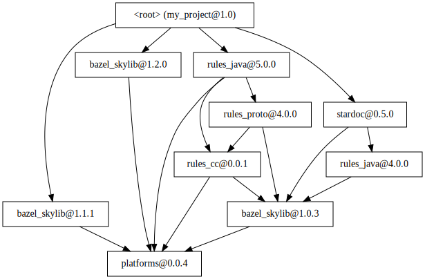

Project: /_project.yaml
Book: /_book.yaml
keywords: Bzlmod

# `mod` Command



The `mod` command, introduced in Bazel 6.3.0, provides a range of tools to help
the user understand their external dependency graph when Bzlmod is enabled. It
lets you visualize the dependency graph, find out why a certain module or a
version of a module is present in the graph, view the repo definitions backing
modules, inspect usages of module extensions and repos they generate, among
other functions.

## Syntax {:#syntax}

```sh
bazel mod <subcommand> [<options>] [<arg> [<arg>...]]
```

The available subcommands and their respective required arguments are:

*   `graph`: Displays the full dependency graph of the project, starting from
    the root module. If one or more modules are specified in `--from`, these
    modules are shown directly under the root, and the graph is only expanded
    starting from them (see [example](#mod-example1)).

*   `deps <arg>...`: Displays the resolved direct dependencies of each of the
    specified modules, similarly to `graph`.

*   `all_paths <arg>...`: Displays all existing paths from the root to the
    specified `<arg>...`. If one or more modules are specified in `--from`,
    these modules are shown directly under the root, and the graph contains any
    any existing path from the `--from` modules to the argument modules (see
    [example](#mod-example4)).

*   `path <arg>...`: Has the same semantics as `all_paths`, but only display a
    single path from one of the `--from` modules to one of the argument modules.

*   `explain <arg>...`: Shows all the places where the specified modules appear
    in the dependency graph, along with the modules that directly depend on
    them. The output of the `explain` command is essentially a pruned version of
    the `all_paths` command, containing 1) the root module; 2) the root module's
    direct dependencies that lead to the argument modules; 3) the argument
    modules' direct dependents; and
    4) the argument modules themselves (see [example](#mod-example5)).

*   `show_repo <arg>...`: Displays the definition of the specified repos (see
    [example](#mod-example6)).

*   `show_extension <extension>...`: Displays information about each of the
    specified extensions: a list of the generated repos along with the modules
    that import them using `use_repo`, and a list of the usages of that
    extension in each of the modules where it is used, containing the specified
    tags and the `use_repo` calls (see [example](#mod-example8)).

`<arg>` refers to one or more modules or repos. It can be one of:

*   The literal string `<root>`: The root module representing your current
    project.

*   `<name>@<version>`: The module `<name>` at version `<version>`. For a module
    with a non-registry override, use an underscore (`_`) as the `<version>`.

*   `<name>`: All present versions of the module `<name>`.

*   `@<repo_name>`: The repo with the given [apparent
    name](overview#apparent-repo-name) in the context of the `--base_module`.

*   `@@<repo_name>`: The repo with the given [canonical
    name](overview#canonical-repo-name).

In a context requiring specifying modules, `<arg>`s referring to repos that
correspond to modules (as opposed to extension-generated repos) can also be
used. Conversely, in a context requiring specifying repos, `<arg>`s referring to
modules can stand in for the corresponding repos.

`<extension>` must be of the form `<arg><label_to_bzl_file>%<extension_name>`.
The `<label_to_bzl_file>` part must be a repo-relative label (for example,
`//pkg/path:file.bzl`).

The following options only affect the subcommands that print graphs (`graph`,
`deps`, `all_paths`, `path`, and `explain`):

*   `--from <arg>[,<arg>[,...]]` *default: `<root>`*: The module(s) from which
    the graph is expanded in `graph`, `all_paths`, `path`, and `explain`. Check
    the subcommands' descriptions for more details.

*   `--verbose` *default: "false"*: Include in the output graph extra
    information about the version resolution of each module. If the module
    version changed during resolution, show either which version replaced it or
    what was the original version, the reason it was replaced, and which modules
    requested the new version if the reason was [Minimal Version
    Selection](module#version-selection).

*   `--include_unused` *default: "false"*: Include in the output graph the
    modules which were originally present in the dependency graph, but became
    unused after module resolution.

*   `--extension_info <mode>`: Include information about the module extension
    usages as part of the output graph (see [example](#mod-example7)). `<mode>`
    can be one of:

    *   `hidden` *(default)*: Don't show anything about extensions.

    *   `usages`: Show extensions under each module where they are used. They
        are printed in the form of `$<extension>`.

    *   `repos`: In addition to `usages`, show the repo imported using
        `use_repo` under each extension usage.

    *   `all`: In addition to `usages` and `repos`, also show
        extension-generated repos that are not imported by any module. These
        extra repos are shown under the first occurrence of their generating
        extension in the output, and are connected with a dotted edge.

*   `--extension_filter <extension>[,<extension>[,...]]`: If specified, the
    output graph only includes modules that use the specified extensions, and
    the paths that lead to those modules. Specifying an empty extension list (as
    in `--extension_filter=`) is equivalent to specifying _all_ extensions used
    by any module in the dependency graph.

*   `--depth <N>`: The depth of the output graph. A depth of 1 only displays the
    root and its direct dependencies. Defaults to 1 for `explain`, 2 for `deps`
    and infinity for the others.

*   `--cycles` *default: "false"*: Include cycle edges in the output graph.

*   `--include_builtin` *default: "false"*: Include built-in modules (such as
    `@bazel_tools`) in the output graph. This flag is disabled by default, as
    built-in modules are implicitly depended on by every other module, which
    greatly clutters the output.

*   `--charset <charset>` *default: utf8*: Specify the charset to use for text
    output. Valid values are `"utf8"` and `"ascii"`. The only significant
    difference is in the special characters used to draw the graph in the
    `"text"` output format, which don't exist in the `"ascii"` charset.
    Therefore, the `"ascii"` charset is present to also support the usage on
    legacy platforms which cannot use Unicode.

*   `--output <mode>`: Include information about the module extension usages as
    part of the output graph. `<mode`> can be one of:

    *   `text` *(default)*: A human-readable representation of the output graph
        (flattened as a tree).

    *   `json`: Outputs the graph in the form of a JSON object (flattened as a
        tree).

    *   `graph`: Outputs the graph in the Graphviz *dot* representation.

    Tip: Use the following command to pipe the output through the *dot* engine
        and export the graph representation as an SVG image.

    ```sh
    bazel mod graph --output graph | dot -Tsvg > /tmp/graph.svg
    ```

Other options include:

*   `--base_module <arg>` *default: `<root>`*: Specify a module relative to
    which apparent repo names in arguments are interpreted. Note that this
    argument itself can be in the form of `@<repo_name>`; this is always
    interpreted relative to the root module.

*   `--extension_usages <arg>[,<arg>[,...]]`: Filters `show_extension` to only
    display extension usages from the specified modules.

## Examples {:#examples}

Some possible usages of the `mod` command on a real Bazel project are showcased
below to give you a general idea on how you can use it to inspect your project's
external dependencies.

`MODULE.bazel` file:

```python
module(
  name = "my_project",
  version = "1.0",
)

bazel_dep(name = "bazel_skylib", version = "1.1.1", repo_name = "skylib1")
bazel_dep(name = "bazel_skylib", version = "1.2.0", repo_name = "skylib2")
multiple_version_override(module_name = "bazel_skylib", versions = ["1.1.1", "1.2.0"])

bazel_dep(name = "stardoc", version = "0.5.0")
bazel_dep(name = "rules_java", version = "5.0.0")

toolchains = use_extension("@rules_java//java:extensions.bzl", "toolchains")
use_repo(toolchains, my_jdk="remotejdk17_linux")
```

<table>
  <tr style="display: flex; flex-direction: row">
    <td style="flex: 5; display: flex; flex-direction: column">
      <figure style="height: 100%; display: flex; flex-direction: column;">
        
        <figcaption style="margin-top: auto; margin-left: auto; margin-right: auto ">Graph Before Resolution</figcaption>
      </figure>
<!-- digraph mygraph {
  node [ shape=box ]
  edge [ fontsize=8 ]
  "<root>" [ label="<root> (my_project@1.0)" ]
  "<root>" -> "bazel_skylib@1.1.1" [  ]
  "<root>" -> "bazel_skylib@1.2.0" [  ]
  "<root>" -> "rules_java@5.0.0" [  ]
  "<root>" -> "stardoc@0.5.0" [  ]
  "bazel_skylib@1.1.1" -> "platforms@0.0.4" [  ]
  "bazel_skylib@1.2.0" -> "platforms@0.0.4" [  ]
  "rules_java@5.0.0" -> "platforms@0.0.4" [  ]
  "rules_java@5.0.0" -> "rules_cc@0.0.1" [  ]
  "rules_java@5.0.0" -> "rules_proto@4.0.0" [  ]
  "stardoc@0.5.0" -> "bazel_skylib@1.0.3" [  ]
  "stardoc@0.5.0" -> "rules_java@4.0.0" [  ]
  "rules_cc@0.0.1" -> "bazel_skylib@1.0.3" [  ]
  "rules_cc@0.0.1" -> "platforms@0.0.4" [  ]
  "rules_proto@4.0.0" -> "bazel_skylib@1.0.3" [  ]
  "rules_proto@4.0.0" -> "rules_cc@0.0.1" [  ]
  "bazel_skylib@1.0.3" [  ]
  "bazel_skylib@1.0.3" -> "platforms@0.0.4" [  ]
  "rules_java@4.0.0" [  ]
  "rules_java@4.0.0" -> "bazel_skylib@1.0.3" [  ]
} -->
    </td>
    <td style="flex: 3; display: flex; flex-direction: column">
      <figure style="height: 100%; display: flex; flex-direction: column;">
        
       <figcaption style="margin-top: auto; margin-left: auto; margin-right: auto ">Graph After Resolution</figcaption>
      </figure>
<!-- digraph mygraph {
  node [ shape=box ]
  edge [ fontsize=8 ]
  "<root>" [ label="<root> (my_project@1.0)" ]
  "<root>" -> "bazel_skylib@1.1.1" [  ]
  "<root>" -> "bazel_skylib@1.2.0" [  ]
  "<root>" -> "rules_java@5.0.0" [  ]
  "<root>" -> "stardoc@0.5.0" [  ]
  "bazel_skylib@1.1.1" -> "platforms@0.0.4" [  ]
  "bazel_skylib@1.2.0" -> "platforms@0.0.4" [  ]
  "rules_java@5.0.0" -> "platforms@0.0.4" [  ]
  "rules_java@5.0.0" -> "rules_cc@0.0.1" [  ]
  "rules_java@5.0.0" -> "rules_proto@4.0.0" [  ]
  "stardoc@0.5.0" -> "bazel_skylib@1.1.1" [  ]
  "stardoc@0.5.0" -> "rules_java@5.0.0" [  ]
  "rules_cc@0.0.1" -> "bazel_skylib@1.1.1" [  ]
  "rules_cc@0.0.1" -> "platforms@0.0.4" [  ]
  "rules_proto@4.0.0" -> "bazel_skylib@1.1.1" [  ]
  "rules_proto@4.0.0" -> "rules_cc@0.0.1" [  ]
} -->
    </td>
  </tr>
</table>

1.  <span id="mod-example1"></span>Display the whole dependency graph of your
    project.

    ```sh
    bazel mod graph
    ```

    ```none
    <root> (my_project@1.0)
    ├───bazel_skylib@1.1.1
    │   └───platforms@0.0.4
    ├───bazel_skylib@1.2.0
    │   └───platforms@0.0.4 ...
    ├───rules_java@5.0.0
    │   ├───platforms@0.0.4 ...
    │   ├───rules_cc@0.0.1
    │   │   ├───bazel_skylib@1.1.1 ...
    │   │   └───platforms@0.0.4 ...
    │   └───rules_proto@4.0.0
    │       ├───bazel_skylib@1.1.1 ...
    │       └───rules_cc@0.0.1 ...
    └───stardoc@0.5.0
        ├───bazel_skylib@1.1.1 ...
        └───rules_java@5.0.0 ...
    ```

    Note: The `...` symbol indicates that the node has already been expanded
    somewhere else and was not expanded again to reduce noise.

2.  <span id="mod-example2"></span>Display the whole dependency graph (including
    unused modules and with extra information about version resolution).

    ```sh
    bazel mod graph --include_unused --verbose
    ```

    ```none
    <root> (my_project@1.0)
    ├───bazel_skylib@1.1.1
    │   └───platforms@0.0.4
    ├───bazel_skylib@1.2.0
    │   └───platforms@0.0.4 ...
    ├───rules_java@5.0.0
    │   ├───platforms@0.0.4 ...
    │   ├───rules_cc@0.0.1
    │   │   ├───bazel_skylib@1.0.3 ... (to 1.1.1, cause multiple_version_override)
    │   │   ├───bazel_skylib@1.1.1 ... (was 1.0.3, cause multiple_version_override)
    │   │   └───platforms@0.0.4 ...
    │   └───rules_proto@4.0.0
    │       ├───bazel_skylib@1.0.3 ... (to 1.1.1, cause multiple_version_override)
    │       ├───bazel_skylib@1.1.1 ... (was 1.0.3, cause multiple_version_override)
    │       └───rules_cc@0.0.1 ...
    └───stardoc@0.5.0
        ├───bazel_skylib@1.1.1 ... (was 1.0.3, cause multiple_version_override)
        ├───rules_java@5.0.0 ... (was 4.0.0, cause <root>, bazel_tools@_)
        ├───bazel_skylib@1.0.3 (to 1.1.1, cause multiple_version_override)
        │   └───platforms@0.0.4 ...
        └───rules_java@4.0.0 (to 5.0.0, cause <root>, bazel_tools@_)
            ├───bazel_skylib@1.0.3 ... (to 1.1.1, cause multiple_version_override)
            └───bazel_skylib@1.1.1 ... (was 1.0.3, cause multiple_version_override)
    ```

3.  <span id="mod-example3"></span>Display the dependency graph expanded from
    some specific modules.

    ```sh
    bazel mod graph --from rules_java --include_unused
    ```

    ```none
    <root> (my_project@1.0)
    ├───rules_java@5.0.0
    │   ├───platforms@0.0.4
    │   ├───rules_cc@0.0.1
    │   │   ├───bazel_skylib@1.0.3 ... (unused)
    │   │   ├───bazel_skylib@1.1.1 ...
    │   │   └───platforms@0.0.4 ...
    │   └───rules_proto@4.0.0
    │       ├───bazel_skylib@1.0.3 ... (unused)
    │       ├───bazel_skylib@1.1.1 ...
    │       └───rules_cc@0.0.1 ...
    └╌╌rules_java@4.0.0 (unused)
        ├───bazel_skylib@1.0.3 (unused)
        │   └───platforms@0.0.4 ...
        └───bazel_skylib@1.1.1
            └───platforms@0.0.4 ...
    ```

    Note: The dotted line is used to indicate an *indirect* (transitive)
    dependency edge between two nodes.

4.  <span id="mod-example4"></span>Display all paths between two of your
    modules.

    ```sh
    bazel mod all_paths bazel_skylib@1.1.1 --from rules_proto
    ```

    ```none
    <root> (my_project@1.0)
    └╌╌rules_proto@4.0.0
        ├───bazel_skylib@1.1.1
        └───rules_cc@0.0.1
            └───bazel_skylib@1.1.1 ...
    ```

5.  <span id="mod-example5"></span>See why and how your project depends on some
    module(s).

    ```sh
    bazel mod explain @skylib1 --verbose --include_unused
    ```

    ```none
    <root> (my_project@1.0)
    ├───bazel_skylib@1.1.1
    ├───rules_java@5.0.0
    │   ├───rules_cc@0.0.1
    │   │   └───bazel_skylib@1.1.1 ... (was 1.0.3, cause multiple_version_override)
    │   └───rules_proto@4.0.0
    │       ├───bazel_skylib@1.1.1 ... (was 1.0.3, cause multiple_version_override)
    │       └───rules_cc@0.0.1 ...
    └───stardoc@0.5.0
        ├───bazel_skylib@1.1.1 ... (was 1.0.3, cause multiple_version_override)
        ├╌╌rules_cc@0.0.1
        │   └───bazel_skylib@1.1.1 ... (was 1.0.3, cause multiple_version_override)
        └╌╌rules_proto@4.0.0
            ├───bazel_skylib@1.1.1 ... (was 1.0.3, cause multiple_version_override)
            └───rules_cc@0.0.1 ...
    ```

6.  <span id="mod-example6"></span>See the underlying rule of some your modules'
    repos.

    ```sh
    bazel mod show_repo rules_cc stardoc
    ```

    ```none
    ## rules_cc@0.0.1:
    # <builtin>
    http_archive(
      name = "rules_cc~0.0.1",
      urls = ["https://bcr.bazel.build/test-mirror/github.com/bazelbuild/rules_cc/releases/download/0.0.1/rules_cc-0.0.1.tar.gz", "https://github.com/bazelbuild/rules_cc/releases/download/0.0.1/rules_cc-0.0.1.tar.gz"],
      integrity = "sha256-Tcy/0iwN7xZMj0dFi9UODHFI89kgAs20WcKpamhJgkE=",
      strip_prefix = "",
      remote_patches = {"https://bcr.bazel.build/modules/rules_cc/0.0.1/patches/add_module_extension.patch": "sha256-g3+zmGs0YT2HKOVevZpN0Jet89Ylw90Cp9XsIAY8QqU="},
      remote_patch_strip = 1,
    )
    # Rule http_archive defined at (most recent call last):
    #   /home/user/.cache/bazel/_bazel_user/6e893e0f5a92cc4cf5909a6e4b2770f9/external/bazel_tools/tools/build_defs/repo/http.bzl:355:31 in <toplevel>

    ## stardoc:
    # <builtin>
    http_archive(
      name = "stardoc~0.5.0",
      urls = ["https://bcr.bazel.build/test-mirror/github.com/bazelbuild/stardoc/releases/download/0.5.0/stardoc-0.5.0.tar.gz", "https://github.com/bazelbuild/stardoc/releases/download/0.5.0/stardoc-0.5.0.tar.gz"],
      integrity = "sha256-yXlNzIAmow/2fPfPkeviRcopSyCwcYRdEsGSr+JDrXI=",
      strip_prefix = "",
      remote_patches = {},
      remote_patch_strip = 0,
    )
    # Rule http_archive defined at (most recent call last):
    #   /home/user/.cache/bazel/_bazel_user/6e893e0f5a92cc4cf5909a6e4b2770f9/external/bazel_tools/tools/build_defs/repo/http.bzl:355:31 in <toplevel>
    ```

7.  <span id="mod-example7"></span>See what module extensions are used in your
    dependency graph.

    ```sh
    bazel mod graph --extension_info=usages --extension_filter=all
    ```

    ```none
    <root> (my_project@1.0)
    ├───$@@rules_java.5.0.0//java:extensions.bzl%toolchains
    ├───rules_java@5.0.0 #
    │   ├───$@@rules_java.5.0.0//java:extensions.bzl%toolchains
    │   ├───rules_cc@0.0.1 #
    │   │   └───$@@rules_cc.0.0.1//bzlmod:extensions.bzl%cc_configure
    │   └───rules_proto@4.0.0
    │       └───rules_cc@0.0.1 ...
    └───stardoc@0.5.0
        └───rules_java@5.0.0 ...
    ```

8.  <span id="mod-example8"></span>See what repositories are generated and
    imported from some specific extension as part of the dependency graph.

    ```sh
    bazel mod show_extension @@rules_java~5.0.0//java:extensions.bzl%toolchains
    ```

    ```none
    <root> (my_project@1.0)
    ├───$@@rules_java.5.0.0//java:extensions.bzl%toolchains
    │   ├───remotejdk17_linux
    │   ├╌╌remotejdk11_linux
    │   ├╌╌remotejdk11_linux_aarch64
    │   ├╌╌remotejdk11_linux_ppc64le
    │   ├╌╌remotejdk11_linux_s390x
    ...(some lines omitted)...
    ├───rules_java@5.0.0 #
    │   └───$@@rules_java.5.0.0//java:extensions.bzl%toolchains ...
    │       ├───local_jdk
    │       ├───remote_java_tools
    │       ├───remote_java_tools_darwin
    │       ├───remote_java_tools_linux
    │       ├───remote_java_tools_windows
    │       ├───remotejdk11_linux_aarch64_toolchain_config_repo
    │       ├───remotejdk11_linux_ppc64le_toolchain_config_repo
    ...(some lines omitted)...
    └───stardoc@0.5.0
        └───rules_java@5.0.0 ...
    ```

9.  <span id="mod-example9"></span>See the list of generated repositories of an
    extension and how that extension is used in each module.

    ```sh
    bazel mod graph --extension_info=all --extension_filter=@rules_java//java:extensions.bzl%toolchains
    ```

    ```none
    ## @@rules_java.5.0.0//java:extensions.bzl%toolchains:

    Fetched repositories:
      -   local_jdk (imported by bazel_tools@_, rules_java@5.0.0)
      -   remote_java_tools (imported by bazel_tools@_, rules_java@5.0.0)
      -   remote_java_tools_darwin (imported by bazel_tools@_, rules_java@5.0.0)
      -   remote_java_tools_linux (imported by bazel_tools@_, rules_java@5.0.0)
      -   remote_java_tools_windows (imported by bazel_tools@_, rules_java@5.0.0)
      -   remotejdk11_linux_aarch64_toolchain_config_repo (imported by rules_java@5.0.0)
      -   remotejdk11_linux_ppc64le_toolchain_config_repo (imported by rules_java@5.0.0)
    ...(some lines omitted)...
      -   remotejdk17_linux (imported by <root>)
      -   remotejdk11_linux
      -   remotejdk11_linux_aarch64
      -   remotejdk11_linux_ppc64le
      -   remotejdk11_linux_s390x
      -   remotejdk11_macos
    ...(some lines omitted)...

    # Usage in <root> at <root>/MODULE.bazel:14:27 with the specified attributes:
    use_repo(
      toolchains,
      my_jdk="remotejdk17_linux",
    )

    # Usage in bazel_tools@_ at bazel_tools@_/MODULE.bazel:23:32 with the specified attributes:
    use_repo(
      toolchains,
      "local_jdk",
      "remote_java_tools",
      "remote_java_tools_linux",
      "remote_java_tools_windows",
      "remote_java_tools_darwin",
    )

    # Usage in rules_java@5.0.0 at rules_java@5.0.0/MODULE.bazel:30:27 with the specified attributes:
    use_repo(
      toolchains,
      "remote_java_tools",
      "remote_java_tools_linux",
      "remote_java_tools_windows",
      "remote_java_tools_darwin",
      "local_jdk",
      "remotejdk11_linux_toolchain_config_repo",
      "remotejdk11_macos_toolchain_config_repo",
      "remotejdk11_macos_aarch64_toolchain_config_repo",
      ...(some lines omitted)...
    )
    ```

10.  <span id="mod-example10"></span>See the underlying rule of some
    extension-generated repositories.

    ```sh
    bazel mod show_repo --base_module=rules_java @remote_java_tools
    ```

    ```none
    ## @remote_java_tools:
    # <builtin>
    http_archive(
      name = "rules_java~5.0.0~toolchains~remote_java_tools",
      urls = ["https://mirror.bazel.build/bazel_java_tools/releases/java/v11.5/java_tools-v11.5.zip", "https://github.com/bazelbuild/java_tools/releases/download/java_v11.5/java_tools-v11.5.zip"],
      sha256 = "b763ee80e5754e593fd6d5be6d7343f905bc8b73d661d36d842b024ca11b6793",
    )
    # Rule http_archive defined at (most recent call last):
    #   /home/user/.cache/bazel/_bazel_user/6e893e0f5a92cc4cf5909a6e4b2770f9/external/bazel_tools/tools/build_defs/repo/http.bzl:355:31 in <toplevel>
    ```