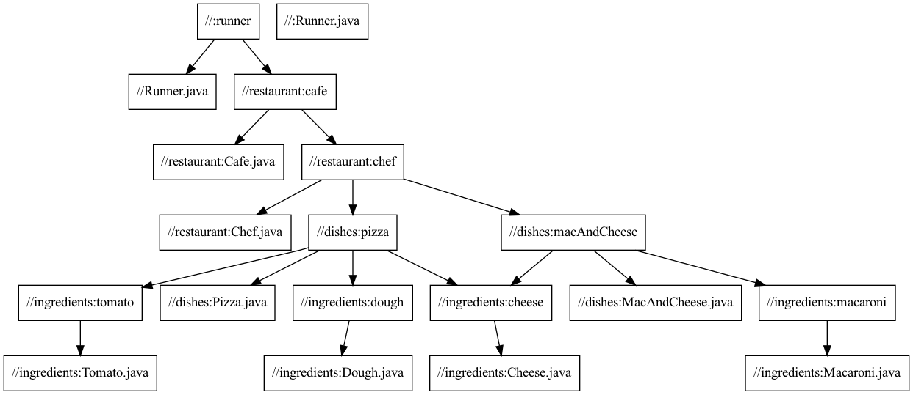
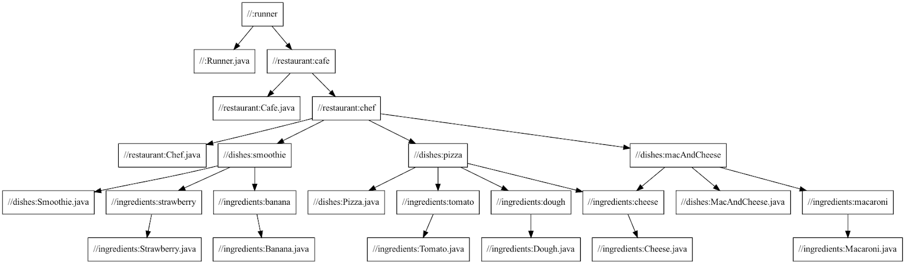
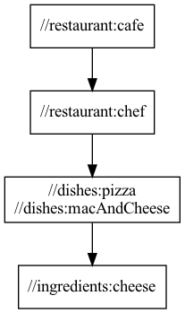

Project: /_project.yaml
Book: /_book.yaml

# Query quickstart

This tutorial covers how to work with Bazel to trace dependencies in your code using a premade Bazel project.

For language and `--output` flag details, see the [Bazel query reference](/query/language) and [Bazel cquery reference](/query/cquery) manuals. Get help in your IDE by typing `bazel help query` or `bazel help cquery` on the command line.

## Objective

This guide runs you through a set of basic queries you can use to learn more about your project's file dependencies. It is intended for new Bazel developers with a basic knowledge of how Bazel and `BUILD` files work.


## Prerequisites

Start by installing [Bazel](https://bazel.build/install), if you haven’t already. This tutorial uses Git for source control, so for best results, install [Git](https://github.com/git-guides/install-git) as well.

To visualize dependency graphs, the tool called Graphviz is used, which you can [download](https://graphviz.org/download/) in order to follow along.

### Get the sample project

Next, retrieve the sample app from [Bazel's Examples repository](https://github.com/bazelbuild/examples) by running the following in your command-line tool of choice:

```posix-terminal
git clone https://github.com/bazelbuild/examples.git
```

The sample project for this tutorial is in the `examples/query-quickstart` directory.

## Getting started

### What are Bazel queries?

Queries help you to learn about a Bazel codebase by analyzing the relationships between `BUILD` files and examining the resulting output for useful information. This guide previews some basic query functions, but for more options see the [query guide](https://bazel.build/query/guide). Queries help you learn about dependencies in large scale projects without manually navigating through `BUILD` files.

To run a query, open your command line terminal and enter:

```posix-terminal
bazel query 'query_function'
```

### Scenario

Imagine a scenario that delves into the relationship between Cafe Bazel and its respective chef. This Cafe exclusively sells pizza and mac & cheese. Take a look below at how the project is structured:

```
bazelqueryguide
├── BUILD
├── src
│   └── main
│       └── java
│           └── com
│               └── example
│                   ├── customers
│                   │   ├── Jenny.java
│                   │   ├── Amir.java
│                   │   └── BUILD
│                   ├── dishes
│                   │   ├── Pizza.java
│                   │   ├── MacAndCheese.java
│                   │   └── BUILD
│                   ├── ingredients
│                   │   ├── Cheese.java
│                   │   ├── Tomatoes.java
│                   │   ├── Dough.java
│                   │   ├── Macaroni.java
│                   │   └── BUILD
│                   ├── restaurant
│                   │   ├── Cafe.java
│                   │   ├── Chef.java
│                   │   └── BUILD
│                   ├── reviews
│                   │   ├── Review.java
│                   │   └── BUILD
│                   └── Runner.java
└── MODULE.bazel
```

Throughout this tutorial, unless directed otherwise, try not to look in the `BUILD` files to find the information you need and instead solely use the query function.

A project consists of different packages that make up a Cafe. They are separated into: `restaurant`, `ingredients`, `dishes`, `customers`, and `reviews`. Rules within these packages define different components of the Cafe with various tags and dependencies.

### Running a build

This project contains a main method inside of `Runner.java` that you can execute
to print out a menu of the Cafe. Build the project using Bazel with the command
`bazel build` and use `:` to signal that the target is named `runner`. See
[target names](https://bazel.build/concepts/labels#target-names) to learn how to
reference targets.

To build this project, paste this command into a terminal:

```posix-terminal
bazel build :runner
```

Your output should look something like this if the build is successful.

```bash
INFO: Analyzed target //:runner (49 packages loaded, 784 targets configured).
INFO: Found 1 target...
Target //:runner up-to-date:
  bazel-bin/runner.jar
  bazel-bin/runner
INFO: Elapsed time: 16.593s, Critical Path: 4.32s
INFO: 23 processes: 4 internal, 10 darwin-sandbox, 9 worker.
INFO: Build completed successfully, 23 total actions
```

After it has built successfully, run the application by pasting this command:

```posix-terminal
bazel-bin/runner
```

```bash
--------------------- MENU -------------------------

Pizza - Cheesy Delicious Goodness
Macaroni & Cheese - Kid-approved Dinner

----------------------------------------------------
```
This leaves you with a list of the menu items given along with a short description.

## Exploring targets

The project lists ingredients and dishes in their own packages. To use a query to view the rules of a package, run the command <code>bazel query <em>package</em>/…</code>

In this case, you can use this to look through the ingredients and dishes that this Cafe has by running:

```posix-terminal
bazel query //src/main/java/com/example/dishes/...
```

```posix-terminal
bazel query //src/main/java/com/example/ingredients/...
```

If you query for the targets of the ingredients package, the output should look like:

```bash
//src/main/java/com/example/ingredients:cheese
//src/main/java/com/example/ingredients:dough
//src/main/java/com/example/ingredients:macaroni
//src/main/java/com/example/ingredients:tomato
```

## Finding dependencies

What targets does your runner rely on to run?

Say you want to dive deeper into the structure of your project without prodding into the filesystem (which may be untenable for large projects). What rules does Cafe Bazel use?

If, like in this example, the target for your runner is `runner`, discover the underlying dependencies of the target by running the command:

```posix-terminal
bazel query --noimplicit_deps "deps(target)"
```

```posix-terminal
bazel query --noimplicit_deps "deps(:runner)"
```

```bash
//:runner
//:src/main/java/com/example/Runner.java
//src/main/java/com/example/dishes:MacAndCheese.java
//src/main/java/com/example/dishes:Pizza.java
//src/main/java/com/example/dishes:macAndCheese
//src/main/java/com/example/dishes:pizza
//src/main/java/com/example/ingredients:Cheese.java
//src/main/java/com/example/ingredients:Dough.java
//src/main/java/com/example/ingredients:Macaroni.java
//src/main/java/com/example/ingredients:Tomato.java
//src/main/java/com/example/ingredients:cheese
//src/main/java/com/example/ingredients:dough
//src/main/java/com/example/ingredients:macaroni
//src/main/java/com/example/ingredients:tomato
//src/main/java/com/example/restaurant:Cafe.java
//src/main/java/com/example/restaurant:Chef.java
//src/main/java/com/example/restaurant:cafe
//src/main/java/com/example/restaurant:chef
```
Note: Adding the flag `--noimplicit_deps` removes configurations and potential toolchains to simplify the list. When you omit this flag, Bazel returns implicit dependencies not specified in the `BUILD` file and clutters the output.

In most cases, use the query function `deps()` to see individual output dependencies of a specific target.

## Visualizing the dependency graph (optional)

Note: This section uses Graphviz, so make sure to [download Graphviz](https://graphviz.org/download/) to follow along.

The section describes how you can visualize the dependency paths for a specific query. [Graphviz](https://graphviz.org/) helps to see the path as a directed acyclic graph image as opposed to a flattened list. You can alter the display of the Bazel query graph by using various `--output` command line options. See [Output Formats](https://bazel.build/query/language#output-formats) for options.

Start by running your desired query and add the flag `--noimplicit_deps` to remove excessive tool dependencies. Then, follow the query with the output flag and store the graph into a file called `graph.in` to create a text representation of the graph.

To search for all dependencies of the target `:runner` and format the output as a graph:

```posix-terminal
bazel query --noimplicit_deps 'deps(:runner)' --output graph > graph.in
```
This creates a file called `graph.in`, which is a text representation of the build graph. Graphviz uses <code>[dot](https://graphviz.org/docs/layouts/dot/) </code>– a tool that processes text into a visualization —  to create a png:

```posix-terminal
dot -Tpng < graph.in > graph.png
```
If you open up `graph.png`, you should see something like this. The graph below has been simplified to make the essential path details clearer in this guide.



This helps when you want to see the outputs of the different query functions throughout this guide.

## Finding reverse dependencies

If instead you have a target you’d like to analyze what other targets use it, you can use a query to examine what targets depend on a certain rule. This is called a “reverse dependency”. Using `rdeps()` can be useful when editing a file in a codebase that you’re unfamiliar with, and can save you from unknowingly breaking other files which depended on it.

For instance, you want to make some edits to the ingredient `cheese`. To avoid causing an issue for Cafe Bazel, you need to check what dishes rely on `cheese`.

Caution: Since `ingredients` is its own package, you must use a different naming convention for the target `cheese` in the form of `//package:target`. Read more about referencing targets, or [Labels](https://bazel.build/concepts/labels).

To see what targets depend on a particular target/package, you can use `rdeps(universe_scope, target)`. The `rdeps()` query function takes in at least two arguments: a `universe_scope` — the relevant directory — and a `target`. Bazel searches for the target’s reverse dependencies within the `universe_scope` provided. The `rdeps()` operator accepts an optional third argument: an integer literal specifying the upper bound on the depth of the search.

Tip: To search within the whole scope of the project, set the `universe_scope` to `//...`

To look for reverse dependencies of the target `cheese` within the scope of the entire project ‘//…’ run the command:

```posix-terminal
bazel query "rdeps(universe_scope, target)"
```
```
ex) bazel query "rdeps(//... , //src/main/java/com/example/ingredients:cheese)"
```
```bash
//:runner
//src/main/java/com/example/dishes:macAndCheese
//src/main/java/com/example/dishes:pizza
//src/main/java/com/example/ingredients:cheese
//src/main/java/com/example/restaurant:cafe
//src/main/java/com/example/restaurant:chef
```
The query return shows that cheese is relied on by both pizza and macAndCheese. What a surprise!

## Finding targets based on tags

Two customers walk into Bazel Cafe: Amir and Jenny. There is nothing known about them except for their names. Luckily, they have their orders tagged in the 'customers' `BUILD` file. How can you access this tag?

Developers can tag Bazel targets with different identifiers, often for testing purposes. For instance, tags on tests can annotate a test's role in your debug and release process, especially for C++ and Python tests, which lack any runtime annotation ability. Using tags and size elements gives flexibility in assembling suites of tests based around a codebase’s check-in policy.

In this example, the tags are either one of `pizza` or `macAndCheese` to represent the menu items. This command queries for targets that have tags matching your identifier within a certain package.

```
bazel query 'attr(tags, "pizza", //src/main/java/com/example/customers/...)'
```
This query returns all of the targets in the 'customers' package that have a tag of "pizza".

### Test yourself

Use this query to learn what Jenny wants to order.

<div>
  <devsite-expandable>
  <h4 class="showalways">Answer</h4>
  <p>Mac and Cheese</p>
  </devsite-expandable>
</div>


## Adding a new dependency

Cafe Bazel has expanded its menu — customers can now order a Smoothie! This specific smoothie consists of the ingredients `Strawberry` and `Banana`.

First, add the ingredients that the smoothie depends on: `Strawberry.java` and `Banana.java`. Add the empty Java classes.

**`src/main/java/com/example/ingredients/Strawberry.java`**

```java
package com.example.ingredients;

public class Strawberry {

}
```

**`src/main/java/com/example/ingredients/Banana.java`**

```java
package com.example.ingredients;

public class Banana {

}
```

Next, add `Smoothie.java` to the appropriate directory: `dishes`.

**`src/main/java/com/example/dishes/Smoothie.java`**

```java
package com.example.dishes;

public class Smoothie {
    public static final String DISH_NAME = "Smoothie";
    public static final String DESCRIPTION = "Yummy and Refreshing";
}
```


Lastly, add these files as rules in the appropriate `BUILD` files. Create a new java library for each new ingredient, including its name, public visibility, and its newly created 'src' file. You should wind up with this updated `BUILD` file:

**`src/main/java/com/example/ingredients/BUILD`**

```
java_library(
    name = "cheese",
    visibility = ["//visibility:public"],
    srcs = ["Cheese.java"],
)

java_library(
    name = "dough",
    visibility = ["//visibility:public"],
    srcs = ["Dough.java"],
)

java_library(
    name = "macaroni",
    visibility = ["//visibility:public"],
    srcs = ["Macaroni.java"],
)

java_library(
    name = "tomato",
    visibility = ["//visibility:public"],
    srcs = ["Tomato.java"],
)

java_library(
    name = "strawberry",
    visibility = ["//visibility:public"],
    srcs = ["Strawberry.java"],
)

java_library(
    name = "banana",
    visibility = ["//visibility:public"],
    srcs = ["Banana.java"],
)
```

In the `BUILD` file for dishes, you want to add a new rule for `Smoothie`. Doing so includes the Java file created for `Smoothie` as a 'src' file, and the new rules you made for each ingredient of the smoothie.

**`src/main/java/com/example/dishes/BUILD`**

```
java_library(
    name = "macAndCheese",
    visibility = ["//visibility:public"],
    srcs = ["MacAndCheese.java"],
    deps = [
        "//src/main/java/com/example/ingredients:cheese",
        "//src/main/java/com/example/ingredients:macaroni",
    ],
)

java_library(
    name = "pizza",
    visibility = ["//visibility:public"],
    srcs = ["Pizza.java"],
    deps = [
        "//src/main/java/com/example/ingredients:cheese",
        "//src/main/java/com/example/ingredients:dough",
        "//src/main/java/com/example/ingredients:tomato",
    ],
)

java_library(
    name = "smoothie",
    visibility = ["//visibility:public"],
    srcs = ["Smoothie.java"],
    deps = [
        "//src/main/java/com/example/ingredients:strawberry",
        "//src/main/java/com/example/ingredients:banana",
    ],
)
```

Lastly, you want to include the smoothie as a dependency in the Chef’s `BUILD` file.

**`src/main/java/com/example/restaurant/BUILD`**

```
java\_library(
    name = "chef",
    visibility = ["//visibility:public"],
    srcs = [
        "Chef.java",
    ],

    deps = [
        "//src/main/java/com/example/dishes:macAndCheese",
        "//src/main/java/com/example/dishes:pizza",
        "//src/main/java/com/example/dishes:smoothie",
    ],
)

java\_library(
    name = "cafe",
    visibility = ["//visibility:public"],
    srcs = [
        "Cafe.java",
    ],
    deps = [
        ":chef",
    ],
)
```

Build `cafe` again to confirm that there are no errors. If it builds successfully, congratulations! You’ve added a new dependency for the 'Cafe'. If not, look out for spelling mistakes and package naming. For more information about writing `BUILD` files see [BUILD Style Guide](https://bazel.build/build/style-guide).

Now, visualize the new dependency graph with the addition of the `Smoothie` to compare with the previous one. For clarity, name the graph input as `graph2.in` and `graph2.png`.


```posix-terminal
bazel query --noimplicit_deps 'deps(:runner)' --output graph > graph2.in
```

```posix-terminal
dot -Tpng < graph2.in > graph2.png
```

[](images/query_graph2.png)

Looking at `graph2.png`, you can see that `Smoothie` has no shared dependencies with other dishes but is just another target that the `Chef` relies on.

## somepath() and allpaths()

What if you want to query why one package depends on another package? Displaying a dependency path between the two provides the answer.

Two functions can help you find dependency paths: `somepath()` and `allpaths()`. Given a starting target S and an end point E, find a path between S and E by using `somepath(S,E)`.

Explore the differences between these two functions by looking at the relationships between the 'Chef' and 'Cheese' targets. There are different possible paths to get from one target to the other:

*   Chef → MacAndCheese → Cheese
*   Chef → Pizza → Cheese

`somepath()` gives you a single path out of the two options, whereas 'allpaths()' outputs every possible path.

Using Cafe Bazel as an example, run the following:

```posix-terminal
bazel query "somepath(//src/main/java/com/example/restaurant/..., //src/main/java/com/example/ingredients:cheese)"
```

```bash
//src/main/java/com/example/restaurant:cafe
//src/main/java/com/example/restaurant:chef
//src/main/java/com/example/dishes:macAndCheese
//src/main/java/com/example/ingredients:cheese
```

The output follows the first path of Cafe → Chef → MacAndCheese → Cheese. If instead you use `allpaths()`, you get:

```posix-terminal
bazel query "allpaths(//src/main/java/com/example/restaurant/..., //src/main/java/com/example/ingredients:cheese)"
```

```bash
//src/main/java/com/example/dishes:macAndCheese
//src/main/java/com/example/dishes:pizza
//src/main/java/com/example/ingredients:cheese
//src/main/java/com/example/restaurant:cafe
//src/main/java/com/example/restaurant:chef
```



The output of `allpaths()` is a little harder to read as it is a flattened list of the dependencies. Visualizing this graph using Graphviz makes the relationship clearer to understand.

## Test yourself

One of Cafe Bazel’s customers gave the restaurant's first review! Unfortunately, the review is missing some details such as the identity of the reviewer and what dish it’s referencing. Luckily, you can access this information with Bazel. The `reviews` package contains a program that prints a review from a mystery customer. Build and run it with:

```posix-terminal
bazel build //src/main/java/com/example/reviews:review
```

```posix-terminal
bazel-bin/src/main/java/com/example/reviews/review
```

Going off Bazel queries only, try to find out who wrote the review, and what dish they were describing.

<div>
  <devsite-expandable>
  <h4 class="showalways">Hint</h4>
  <p>Check the tags and dependencies for useful information.</p>
  </devsite-expandable>
</div>

<div>
  <devsite-expandable>
  <h4 class="showalways">Answer</h4>
  <p>This review was describing the Pizza and Amir was the reviewer. If you look at what dependencies that this rule had using
  <code>bazel query --noimplicit\_deps 'deps(//src/main/java/com/example/reviews:review)'</code>
  The result of this command reveals that Amir is the reviewer!
  Next, since you know the reviewer is Amir, you can use the query function to seek which tag Amir has in the `BUILD` file to see what dish is there.
  The command <code>bazel query 'attr(tags, "pizza", //src/main/java/com/example/customers/...)'</code> output that Amir is the only customer that ordered a pizza and is the reviewer which gives us the answer.
  </p>
  </devsite-expandable>
</div>

## Wrapping up

Congratulations! You have now run several basic queries, which you can try out on own projects. To learn more about the query language syntax, refer to the [Query reference page](https://bazel.build/query/language). Want more advanced queries? The [Query guide](https://bazel.build/query/guide) showcases an in-depth list of more use cases than are covered in this guide.
