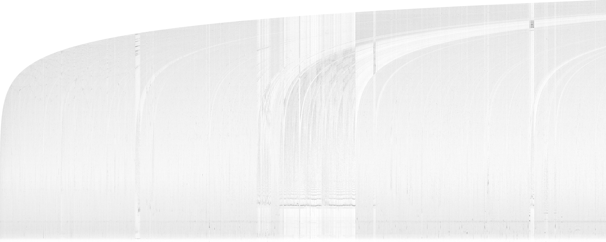
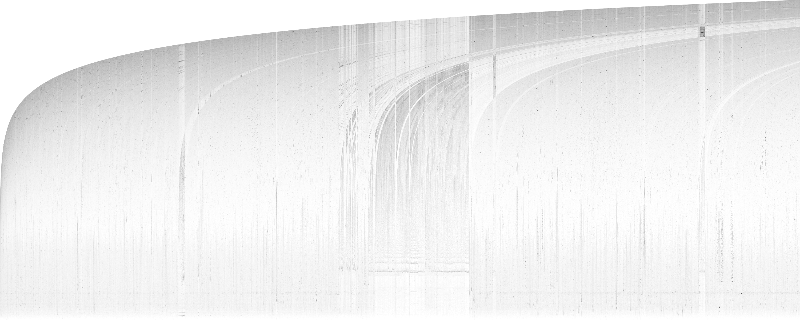

## Introduction

In this directory we publish simple tools to analyze backward reference distance distributions in LZ77 compression. We developed these tools to be able to make more efficient encoding of distances in large-window brotli. In large-window compression the average cost of a backward reference distance is higher, and this may allow for more advanced encoding strategies, such as delta coding or an increase in context size, to bring significant compression density improvements. Our tools visualize the backward references as histogram images, i.e., one pixel in the image shows how many distances of a certain range exist at a certain locality in the data. The human visual system is excellent at pattern detection, so we tried to roughly identify patterns visually before going into more quantitative analysis. These tools can turn out to be useful in development of  other LZ77-based compressors and we hope you try them out.


## Tools
### find\_opt\_references

This tool generates optimal (match-length-wise) backward references for every position in the input files and stores them in `*.dist` file described below.

Example usage:

    find_opt_references input.txt output.dist

### draw\_histogram

This tool generates a visualization of the distribution of backward references stored in `*.dist` file. The original file size has to be specified as a second parameter. The output is a grayscale PGM (binary) image.

Example usage:

    draw_histogram input.dist 65536 output.pgm

Here's an example of resulting image:



### draw\_diff

This tool generates a diff PPM (binary) image between two input 8-bit PGM (binary) images. Input images must be of same size. Useful for comparing different backward references distributions for same input file. Normally used for comparison of output images from `draw_histogram` tool.

Example usage:

    draw_diff image1.pgm image2.pgm diff.ppm

For example the diff of this image


and this image



looks like this:


## Backward distance file format

The format of `*.dist` files is as follows:

    [[     0| match length][     1|position|distance]...]
     [1 byte|      4 bytes][1 byte| 4 bytes| 4 bytes]

More verbose explanation: for each backward reference there is a position-distance pair, also a copy length may be specified. Copy length is prefixed with flag byte 0, position-distance pair is prefixed with flag byte 1. Each number is a 32-bit integer. Copy length always comes before position-distance pair. Standalone copy length is allowed, in this case it is ignored.

Here's an example of how to read from `*.dist` file:

```c++
#include "read_dist.h"

FILE* f;
int copy, pos, dist;
while (ReadBackwardReference(fin, &copy, &pos, &dist)) {
   ...
}
```
